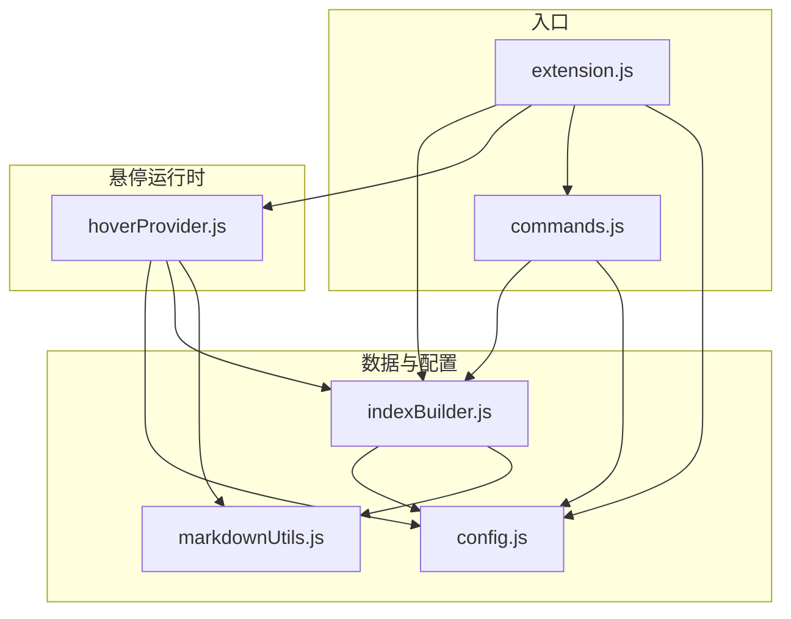

# 术语管理模块

*版本：V1.1，上次更新：2026-6-11*

[模块功能](../../extension/docs/README.zh-cn.md#2-1.术语管理)

## 1. 模块结构

本模块涉及到的文件如下：

- `indexBuilder.js`：构建和更新术语索引；
  - 依赖 `config.js` 获取 `hoverFiles`、`titleLevel`、`aliasField` 等配置。
  - 依赖 `markdownUtils.js` 中的 `getTitlePattern()`、`parseFieldLine()`、`parseHoverComment()` 等解析工具。
- `hoverProvider.js`：注册悬停提供器，实现术语匹配与卡片渲染；
  - 依赖 `config.js` 获取 `scanRange`、`hoverField`、`showFields`、`previewMode` 等配置信息；
  - 依赖 `indexBuilder.js` 获取 `TermMap` 用于术语查找；
  - 依赖 `markdownUtils.js` 中的 `getTermInfo()` 读取术语完整字段内容。
- `markdownUtils.js`：提供 Markdown 解析纯函数（标题正则、字段行解析、注释解析）以及 `getTermInfo()` 信息提取函数。
- `config.js`：从 VS Code 设置中读取并缓存所有配置。
- `commands.js`：注册三条命令（showDetail / editTerm / reload）和文件保存监听器。
- `extension.js`：扩展入口，在 `activate()` 阶段依次初始化各模块。

依赖关系图如下：



---

## 2. 核心数据结构

### 2-1. TermMap

`TermMap` 是术语悬停的核心数据，起到缓存术语名→文件定位的作用。它是一个 `Map<string, TermInfo>`，键为术语名或别名，值为定位信息：

```javascript
interface TermInfo {
    filePath: string,  // 术语所在档案的绝对路径
    lineNum: number    // 标题行在文件中的 0-based 行号
}
```

若术语有别名，则**别名与主术语平等共存于同一个 Map 中**，各自映射到同一份 `TermInfo`。这意味着：
- 悬停时只需一次 `TermMap.get(word)` 即可获得位置信息，无需区分主名还是别名。
- 术语名/别名的查表性能相同（Map.prototype.has 为 O(1)）。

### 2-2. watchedFiles

一个 `Set<string>`，存储当前受监控的术语档案文件绝对路径。用于在文件保存时判断是否需要增量更新索引：

```javascript
const watchedFiles = new Set();
// 仅在 watchedFiles 中的文件保存时触发 updateIndexForFile()
```

`watchedFiles` 在每次 `buildIndex()` 时被清空并重新填充，确保文件路径始终与最新的 `hoverFiles` 配置匹配。

---

## 3. 核心算法

### 3-1. 术语档案解析算法（构建 TermMap）

该算法在以下两种场景中被调用：
- **全量构建**：`buildIndex()` — 扩展激活或手动重载时执行
- **增量更新**：`updateIndexForFile()` — 被监控的档案文件保存时执行

两个场景都调用 `parseSingleFileAndUpdateIndex()`，内部执行流程如下：

```
输入：filePath（术语档案的绝对路径）

1. 打开文件，按行分割 ← lines[]
2. 逐行跳过文件级 @hover 注释（lineNum 同步递增）
   ├── 解析注释覆盖 titleLevel、aliasField
   └── 注释结束后生成标题正则 /^#{titleLevel}\s+(.+)$/
3. 进入主遍历（while + lineNum 指针）：
   ├── 匹配标题行 → 记录上一个术语到 TermMap，当前行设为新的术语名
   ├── 匹配 @hover 注释 → 累加进 overrides 对象
   ├── overrides.exclude === "true" → 标记 currentName = null，跳过整个术语块
   ├── 匹配字段行 → 若字段名 == aliasField，分割出别名列表，逐个加入 TermMap
   └── lineNum++ → 继续下一行
4. 文件遍历结束 → 处理最后一个术语

输出：TermMap 完成填充
```

**关键设计决策：**

- **行号指针统一递增**：`lineNum` 在主循环的每次迭代末尾 `lineNum++`，确保每一行（无论是否为标题、注释、字段）都准确计数。之前的版本因 `continue` 跳过行号递增，已被修复。
- **不提取字段值**：构建 TermMap 时只记录术语名、别名、文件路径和行号，不解析字段内容。字段内容的提取延迟到悬停触发时由 `getTermInfo()` 执行，避免在索引构建时全量解析所有字段。
- **注释行不下移**：之前的版本使用 `lines.shift()` 逐行移除文件级注释，修改了原数组，导致后续统计行号时指针错位。当前版本改用 `lineNum` 递增跳过注释行，保持数组完整。

### 3-2. 信息提取算法（getTermInfo）

在悬停触发时由 `hoverProvider.js` 调用，为单个术语提取其字段内容。输入为 `(filePath, lineNum)`，输出为完整的悬停信息。

```
输入：filePath（档案文件绝对路径）, lineNum（标题行 0-based 行号）

1. 读取配置文件级 @hover 注释
   ├── 从 line 0 开始逐行读取
   ├── 遇到非 @hover 行则停止
   └── 合并覆盖到 currentConfig

2. 定位到 lineNum 行，提取 anchor（标题文本，去掉前导 #）

3. 读取术语级 @hover 注释（lineNum + 1 开始）
   ├── 逐行匹配 @hover 注释并合并到 currentConfig
   └── 遇到非注释行则停止

4. 逐行解析字段行（- **字段名**: 值）
   ├── 若字段名 == currentConfig.hoverField → 存入 hoverField
   ├── 若字段名 ∈ currentConfig.showFields → 存入 fields 映射
   └── 遇到非字段行或文件末尾则停止

输出：{
    anchor: string,         // URL 锚点（术语名原文）
    hoverField: string,     // 主字段对应值
    showFields: string[],   // 额外显示的字段名列表
    fields: { name: value } // 该术语下所有解析到的字段
}
```

### 3-3. 术语悬停算法（匹配 + 渲染）

当用户在 Markdown 或纯文本文件中将鼠标悬停在文本上时，由 `hoverProvider.js` 中的 `provideHover()` 处理。

```
输入：document（当前文档）, position（光标位置）

1. 光标区域截取
   ├── 从 cursorChar 开始，向左扩展最多 scanRange 个字符
   │     （仅限中文、英文字母、数字、下划线）
   ├── 向右扩展最多 scanRange 个字符
   └── 截取得到 block 字符串，长度 ≤ 2×scanRange + 1

2. 术语匹配（双重循环 + 最长优先）
   │   for i ← 0 to block.length-1:
   │       for j ← i+1 to block.length:
   │           cand = block[i..j]
   │           if TermMap.has(cand) AND cand.length > maxLen:
   │               matchedTerm = cand
   │               break  // 当前起点已找到最长匹配，跳内层
   │       if matchedTerm → break  // 找到匹配，跳外层
   ├── 匹配策略：枚举所有子串，取最长匹配项
   └── 未匹配 → 返回 null

3. 信息读取
   ├── TermMap.get(matchedTerm) → { filePath, lineNum }
   └── getTermInfo(filePath, lineNum) → { anchor, hoverField, showFields, fields }

4. 构建 Markdown 悬停卡片
   ├── 第1行: **术语名**
   ├── 第2行: hoverField 纯文本值（如果存在）
   ├── 后续行: 对 showFields 中的每个字段名，从 fields 取值渲染
   │     **字段名**: 字段值
   ├── 分隔线: ---
   ├── 命令链接: 查看完整设定 / 编辑术语设定
   └── 包装为 vscode.Hover 返回

输出：vscode.Hover（含 Markdown 卡片内容），或 null（无匹配）
```

**复杂度：** 文本块最大长度 2×scanRange+1（默认 5，即最长 11 字符），枚举所有子串最多 (11×12)/2 = 66 个。`TermMap.has()` 为 O(1)，因此单次悬停匹配的复杂度 O(scanRange²)，可忽略不计。

**配置优先级链（逐级覆盖）：**
```
术语级 @hover 注释  >  文件级 @hover 注释  >  全局配置  >  默认值
```

### 3-4. 增量更新算法

当用户保存术语档案文件时，`commands.js` 中注册的 `onDidSaveTextDocument` 监听器触发：

```
1. 获取保存文件的绝对路径
2. 检查路径是否在 watchedFiles 集合中
3. 若在 → 调用 updateIndexForFile(filePath)
       └→ parseSingleFileAndUpdateIndex(filePath) 完整重解析该文件
4. 若不在 → 跳过
```

**设计选择：** 当前实现是直接重解析整个文件，而非按 diff 增量更新。对于术语档案规模通常在几十到几百 KB 的场景，这种"全量替换"的方式更简单可靠，不会因 diff 边界条件引发索引不一致。

---

## 4. 与其他模块的交互

### 4-1. extension.js

扩展激活时依次调用：
1. `loadConfig()` — 加载初始配置
2. `await buildIndex()` — 构建 TermMap
3. `registerHoverProvider()` — 注册悬停提供器，返回的 Disposable 推入 `context.subscriptions`
4. `registerCommands(context)` — 注册命令和文件保存监听器

三个步骤有隐式依赖关系：`buildIndex()` 必须在 `registerHoverProvider()` 之前完成，因为 hoverProvider 在初始化时会捕获一次 `getTermMap()` 的引用。如果索引尚未构建，TermMap 为空，悬停不会触发任何匹配。

### 4-2. commands.js

术语管理模块向外暴露三条命令：

| 命令 | 触发方式 | 行为 |
|------|----------|------|
| `writing-assistant.showDetail` | 悬停卡片点击 | 以 Markdown 预览打开档案文件并定位到术语标题 |
| `writing-assistant.editTerm` | 悬停卡片点击 | 在编辑器打开档案文件，选中并高亮术语名 |
| `writing-assistant.reload` | 命令面板 | 重载配置、重建索引、刷新字数统计 |

文件保存监听器也注册在 `commands.js` 中，它会根据 `watchedFiles` 判断是否需要触发增量更新。

### 4-3. config.js

术语管理模块使用的配置项：

```javascript
term: {
    hoverFiles: string[],    // 术语档案文件路径（glob 模式）
    titleLevel: number,      // 标题级别（1-6）
    hoverField: string,      // 悬停卡片主字段名
    aliasField: string,      // 别名字段名
    showFields: string[],    // 额外显示的字段列表
    scanRange: number        // 术语匹配扫描范围（字符数）
}
```

所有配置项通过 `getConfig().term` 访问。配置变更后需执行 `reloadConfig()` + 手动或保存触发索引重建。

### 4-4. markdownUtils.js

提供四个导出函数，均为纯函数（`getTermInfo` 因需要 VSCode API 读取文件，为 async 函数）：

| 函数 | 输入 | 输出 | 用途 |
|------|------|------|------|
| `getTitlePattern(level)` | 标题级别 | RegExp | 生成标题匹配正则 |
| `parseFieldLine(line)` | 行文本 | `{ fieldName, fieldValue }` 或 null | 提取字段 |
| `parseHoverComment(line, isFileLevel)` | 行文本 + 是否为文件级 | Object 或 null | 提取 @hover 指令 |
| `getTermInfo(filePath, lineNum)` | 文件路径 + 行号 | 完整悬停信息对象 | 信息提取（异步） |

---

## 5. 限制与注意事项

- **仅处理工作区内的文件**：`vscode.workspace.findFiles()` 仅在工作区根目录下搜索。若工作区未打开（`workspaceFolders` 为空），扩展会在 `activate()` 时提示并直接退出。
- **术语名建议使用简短核心词汇**：TermMap 存储在内存中，每个术语/别名占一个 Map 条目。大量（数千个以上）术语可能导致内存占用过高和索引构建耗时增加。设计假设是**核心术语数量有限**（通常几十到几百个），未针对大规模场景优化。
- **别名仅从字段行提取**：别名仅识别 `- **别名字段**: 值` 格式的行，不支持从标题或其他位置派生别名。如果用户配置的 `aliasField` 值与字段名不匹配，别名不会注册。
- **扫描范围限制**：`scanRange` 默认值为 5，即光标左右各扩展 5 字符。如果术语名长度超过 11 字符（左右扩展 + 光标本身），将无法完整匹配。用户需根据最长术语手动调整此值。
- **无增量差异更新**：文件保存时触发全量重解析，而非增量更新（diff）。对大型档案文件（50KB+）的频繁保存可能产生可感知的延迟。
- **同名字术语覆盖**：如果多个档案文件中存在同名的术语，以后加载的文件为准。加载顺序由 `hoverFiles` 中的 pattern 匹配顺序和 `vscode.workspace.findFiles()` 的返回顺序共同决定。
- **术语名中英文均可使用**：标题正则对 Unicode 字符无限制，中文、英文、数字、符号均可作为术语名（`//` 等特殊字符可能影响正则匹配或 URL 锚点，建议避免）。
- **Markdown 前端内容（front matter）**：如果档案文件包含 YAML front matter（`---\n...\n---`），目前不会被跳过。文件开头的 `---` 不匹配 `<!--` 注释检测，会被当作普通行处理。如果 front matter 中包含 `##` 等标题语法，可能被误解析为术语定义。

---

## 6. 可扩展性

### 6-1. 增加新的指令键

在 `@hover` 注释中支持新的覆盖指令只需两步：
1. 在 `markdownUtils.js` 的 `parseHoverComment()` 中无需改动（键值对解析已通用化）
2. 在 `getTermInfo()` 或 `parseSingleFileAndUpdateIndex()` 中消费新的键值对

例如，若要支持 `hoverColor=red` 改变悬停卡片的颜色，只需在相关渲染逻辑中添加分支判断。

### 6-2. 支持新的字段格式

当前仅识别 `- **字段名**: 值` 的 Markdown 格式。若要支持其他格式（如表格、定义列表等），只需扩展 `markdownUtils.js` 中的 `parseFieldLine()` 函数，添加新的匹配分支。

### 6-3. 在其他语言中复用 TermMap

TermMap 是一份纯内存索引，不依赖 VSCode API。若需要在其他编辑器（如 Neovim、IntelliJ）中复用类似功能，只需重新实现文件解析逻辑（调用方用对应语言的 Markdown 解析器），而 TermMap 的数据结构设计可以直接借鉴。

### 6-4. 添加更多命令

需在 `commands.js` 中使用 `vscode.commands.registerCommand()` 注册新命令，在 `package.json` 的 `contributes.commands` 中声明命令元数据，并在 `extension.js` 中确保命令在 `activate()` 阶段注册。
