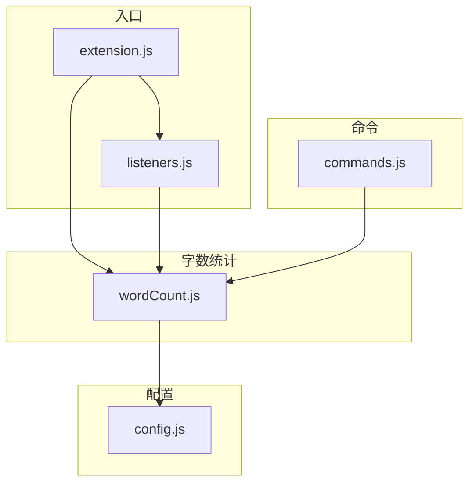

# 字数统计模块

[模块功能](../../docs/user/README.zh-cn.md#2-2-字数统计)

## 1. 模块结构

本模块涉及到的文件如下：

- `wordCount.js`：字数统计模块的主文件；
  - 依赖 `config.js` 获取 `wordCount.enabled`、`wordCount.excludeHeaders`、`wordCount.excludeBlankLines` 等配置项。
  - 导出 `initWordCount(context)`，接收 `ExtensionContext` 用于创建状态栏项并更新一次字数。
  - 导出 `updateWordCount()`，供外部模块（如 listeners.js、commands.js）手动触发字数刷新。
- `config.js`：获取相关配置；
- `listeners.js`：注册所有与字数统计相关的事件监听器（编辑器切换、文本变更、选区变更）；
- `commands.js`：在重载术语索引时调用 `updateWordCount()` 刷新状态栏；
- `extension.js`：扩展入口，在 `activate()` 阶段调用 `initWordCount(context)` 完成初始化。

**字数统计的监听器已于 V2.0 从 `wordCount.js` 分离到 `listeners.js` 中统一管理。** `initWordCount()` 现在仅负责创建状态栏项并执行首次更新，不再自行注册事件监听器。

依赖关系图如下：



---

## 2. 核心数据结构

### 2-1. statusBarItem

一个 `vscode.StatusBarItem` 对象，用于在 VSCode 底部状态栏右侧显示字数。

```javascript
statusBarItem = vscode.window.createStatusBarItem(
    vscode.StatusBarAlignment.Right,  // 状态栏右侧对齐
    100                                // 优先级
);
```

### 2-2. wordCountTimeout

防抖定时器的句柄，类型为 `number | null`。用于避免高频更新（如连续输入时）导致的重复渲染。

### 2-3. computeWordCount 返回值

```javascript
{
    fullChars: number,      // 全文有效字符数
    selectedChars: number,  // 选中区域有效字符数
    isSelected: boolean     // 是否有选区
}
```

这三个字段由 `computeWordCount()` 计算，交由 `updateWordCount()` 消费并渲染。

---

## 3. 核心算法

### 3-1. 字数计算算法

该算法的输入为 `(文档全文, 选区, 配置)`，输出为 `(全文有效字符数, 选区有效字符数)`。

**执行流程：**

`countText(text, config)`:
1. 按换行符分割文本 → 行数组
2. 若 `excludeHeaders = true` → 滤除以 `"#"` 开头的行
3. 若 `excludeBlankLines = true` → 滤除空行 / 空白行
4. 合并行数组 → 得到无换行的连续文本
5. 将连续英文单词替换为单个字符 `"a"`
   （正则 `/\b[a-zA-Z]+\b/g` → `"a"`，实现"一个英文单词计为 1 个字符"）
6. 删除所有空白字符（`\s`，包括空格、制表符等）
7. 取 `length` 返回

**核心函数映射：**
| 函数 | 输入 | 输出 | 职责 |
|------|------|------|------|
| `countText(text, config)` | 原始文本 + 配置 | 字符数 | 纯计算：过滤→英文单词归一→去空白→计数 |
| `computeWordCount(doc, selection, config)` | 文档对象 + 选区 + 配置 | `{fullChars, selectedChars, isSelected}` | 调用 countText 分别处理全文和选区 |
| `updateWordCount()` | 无（使用当前编辑器和配置） | 无 | 检查条件→防抖→计算→渲染状态栏 |
| `initWordCount(context)` | ExtensionContext | 无 | 创建状态栏项 + 首次更新 |

**统计规则：**

- **英文单词处理**：连续英文字母（`[a-zA-Z]+`）被整体替换为单个字符 `"a"`，即一个英文单词无论多长都计为 1 个"字符"。这是为了近似"词数"的统计效果。例如 `"hello world"` 经处理后变成 `"aa"`，计数为 2。
- 中文、数字、标点符号均逐字符计入。
- `excludeHeaders` 仅按行首 `#` 判断，不区分标题级别。
- `excludeBlankLines` 的判断条件是 `trim().length === 0`，即纯空白行或空行。
- 统计不受文件编码影响（VS Code 以 UTF-16 读取，`length` 对 BMP 字符返回 1，对补充平面字符返回 2，但日常使用可忽略此差异）。

**复杂度：** O(N)，N 为文档字符数。

### 3-2. 事件驱动更新算法

字数统计的更新由三类事件驱动，监听器统一注册在 `listeners.js` 中：

```
用户操作
  ├── 切换编辑器标签页
  │     └── listeners.js: onDidChangeActiveTextEditor
  │           └── updateWordCount()
  ├── 编辑文档内容（输入、删除、粘贴等）
  │     └── listeners.js: onDidChangeTextDocument
  │           └── 仅当 e.document === 当前活动编辑器时才触发
  │                 └── updateWordCount()
  └── 改变选区（鼠标拖动、键盘选中）
        └── listeners.js: onDidChangeTextEditorSelection
              └── 仅当活动编辑器是 .txt 文件时才触发（减少不必要计算）
                    └── updateWordCount()
              ↓
updateWordCount()
  ├── 检查 statusBarItem 是否存在 → 否则跳过
  ├── 检查活动编辑器是否存在 → 否则跳过
  ├── 检查当前文件是否为 .txt → 否则隐藏状态栏
  ├── 检查 wordCount.enabled 是否为 true → 否则隐藏状态栏
  ├── 防抖：取消上一个 setTimeout（16ms），重新排队
  ├── 调用 computeWordCount(doc, editor.selection, config)
  ├── 格式化显示文本
  │     ├── 有选区 → "$(pencil) 选中字数/全文字数"
  │     └── 无选区 → "$(pencil) 全文字数"
  └── 更新 statusBarItem.text 并调用 .show()
```

**注意**：`onDidChangeTextEditorSelection` 的 `.txt` 过滤是在 `listeners.js` 中完成的，而非 `wordCount.js`。`updateWordCount()` 本身也会对非 `.txt` 文件隐藏状态栏，形成双重保障。

### 3-3. 防抖机制

当用户连续输入时，`onDidChangeTextDocument` 会高频触发。为避免每次输入都执行完整的计算与 DOM 更新，采用简单的定时器防抖：

```javascript
if (wordCountTimeout) clearTimeout(wordCountTimeout);
wordCountTimeout = setTimeout(() => {
    // 执行计算和渲染
    wordCountTimeout = null;
}, 16);  // 约 60fps，兼顾流畅度与性能
```

16ms 的防抖间隔意味着：
- 快速连续输入时，仅停止输入后约 16ms 才更新一次
- 选区拖拽时同理
- 实测千字规模的 `.txt` 文件单次计算耗时 < 2ms，防抖主要减少的是 DOM 更新频率

---

## 4. 与其他模块的交互

### 4-1. extension.js（入口）

扩展激活时调用 `initWordCount(context)` 完成一次初始化。该方法内部：
1. 创建 `statusBarItem`（状态栏项在创建时默认隐藏）
2. 将其推入 `context.subscriptions` 以便扩展停用时自动释放
3. 立即调用一次 `updateWordCount()` 以显示当前编辑器字数

字数统计的监听器**不再由 `wordCount.js` 自行注册**，而是在 `extension.js` 后续调用 `registerListeners(context)` 时由 `listeners.js` 统一完成。

### 4-2. listeners.js（监听器注册）

字数统计涉及以下在 `listeners.js` 中注册的监听器：

| 监听器 | 事件 | 行为 | 特殊过滤 |
|--------|------|------|----------|
| `onDidChangeActiveTextEditor` | 切换编辑器标签页 | 无差别调用 `updateWordCount()` | 无 |
| `onDidChangeTextDocument` | 文档内容变更 | 仅变更的文档是当前活动编辑器时才调用 `updateWordCount()` | 通过 `e.document === vscode.window.activeTextEditor?.document` 判断 |
| `onDidChangeTextEditorSelection` | 选区变更 | 仅 `.txt` 文件才调用 `updateWordCount()` | 通过 `editor.document.fileName.endsWith('.txt')` 判断 |

这些监听器与文件保存监听器（用于术语索引增量更新）、悬停提供器等一同注册。

### 4-3. commands.js（命令注册）

命令 `writing-assistant.reload` 的重载流程中，在重新构建索引后调用 `updateWordCount()`，确保配置变更后字数统计随之刷新。

### 4-4. config.js（配置管理）

`wordCount` 配置项在 `config.js` 中统一加载，结构如下：

```javascript
wordCount: {
    enabled: boolean,           // 是否启用字数统计
    excludeHeaders: boolean,    // 是否排除标题行（以 # 开头的行）
    excludeBlankLines: boolean  // 是否排除空行
}
```

配置变更后需执行 `reloadConfig()` + 触发 `updateWordCount()` 才能生效。扩展会在每次 `updateWordCount()` 调用中重新读取 `getConfig()`，因此配置更新是热生效的。

### 4-5. 完整调用链

```
扩展激活时：
  extension.js
    ├── initWordCount(context)       // 创建状态栏项 + 首次更新
    │     └── updateWordCount()
    └── registerListeners(context)   // 注册所有监听器
          ├── onDidChangeActiveTextEditor → updateWordCount()
          ├── onDidChangeTextDocument    → updateWordCount()
          └── onDidChangeTextEditorSelection → updateWordCount()

运行时：
  用户操作 → 监听器触发 → updateWordCount()
    ├── 防抖(16ms) → computeWordCount(doc, selection, config)
    │     ├── countText(fullText, config)      → fullChars
    │     └── countText(selectedText, config)  → selectedChars
    └── 渲染状态栏

手动重载时：
  commands.js: reload 命令
    ├── reloadConfig()
    ├── buildIndex(true)
    └── updateWordCount()              // 刷新状态栏
```

---

## 5. 限制与注意事项

- **仅对 `.txt` 文件启用**：`wordCount.js` 中通过 `doc.fileName.endsWith('.txt')` 判断。这是为了避免在 Markdown、代码文件等场景中产生不必要的统计干扰。如需支持其他文件类型，可将此判断改为可配置项或移除。
- **英文单词计为 1**：`countText()` 中使用 `text.replace(/\b[a-zA-Z]+\b/g, 'a')` 将每个英文单词替换为单个字符。这意味着 `"hello"` 和 `"antidisestablishment"` 都计为 1，这是一个粗略的"词数近似"策略。对混合中英文文本，这可能导致统计结果与纯"字符数"预期有偏差。
- **非空白字符统计**：字数统计的不是"词数"也不是纯"字符数"，而是"英文单词数 + 非空白中文字符/数字/标点数"。空格、制表符、换行均不纳入。
- **选区统计适用相同过滤规则**：选区内的字符统计与全文适用相同的标题/空行排除规则和英文单词处理规则。如果排除标题行，选中包含 `# 标题` 的部分也不会计入。
- **无选区时不显示 "0"**：当文档为空时，状态栏显示 `$(pencil) 0`；切换到非 `.txt` 文件时隐藏状态栏。
- **状态栏优先级为 100**：如果其他扩展也注册了右侧状态栏项，优先级数值越小越靠右，100 属于中等优先级。
- **监听器双重过滤**：选区变更监听器在 `listeners.js` 中已按 `.txt` 文件过滤（`fileName.endsWith('.txt')`），但 `updateWordCount()` 内部也会对非 `.txt` 文件执行 `statusBarItem.hide()`，形成双层保护，确保非目标文件不会意外显示字数。

---

## 6. 可扩展性

### 6-1. 增加新的统计维度

若需增加其他统计功能（如纯字符级统计、统计标点、统计空格、统计段落数等），可在 `countText()` 中扩展计算逻辑并返回结构化结果，然后在 `updateWordCount()` 中调整渲染逻辑。

### 6-2. 修改英文单词处理策略

当前英文单词统一替换为 `"a"`（每个单词计 1）。若需改为"逐字母计数"或"按音节计数"，只需修改 `countText()` 中的正则替换逻辑：

```javascript
// 逐字母计数：去掉替换步骤，直接保留字母字符
// text = text.replace(/\b[a-zA-Z]+\b/g, 'a');  // 删除这行

// 或按某种加权规则替换
// text = text.replace(/\b[a-zA-Z]+\b/g, match => 'a'.repeat(Math.ceil(match.length / 3)));
```

### 6-3. 支持更多文件类型

当前限 `.txt` 文件。若需扩展，有两处需要同步修改：
1. `listeners.js` 中选区变更监听器的 `.txt` 判断条件
2. `updateWordCount()` 中的 `.txt` 判断条件

建议提取为配置项 `wordCount.fileExtensions` 并在 `config.js` 中集中管理。

### 6-4. 新增配置项

需同时在以下位置添加：
- `config.js` — 在 `loadConfig()` 的 `wordCount` 对象中添加字段
- `package.json` — 在 `contributes.configuration.properties` 中添加配置声明
- `wordCount.js` — 在 `countText()` 或 `updateWordCount()` 中消费新配置

配置项命名遵循 `writingAssistant.wordCount.*` 模式。
