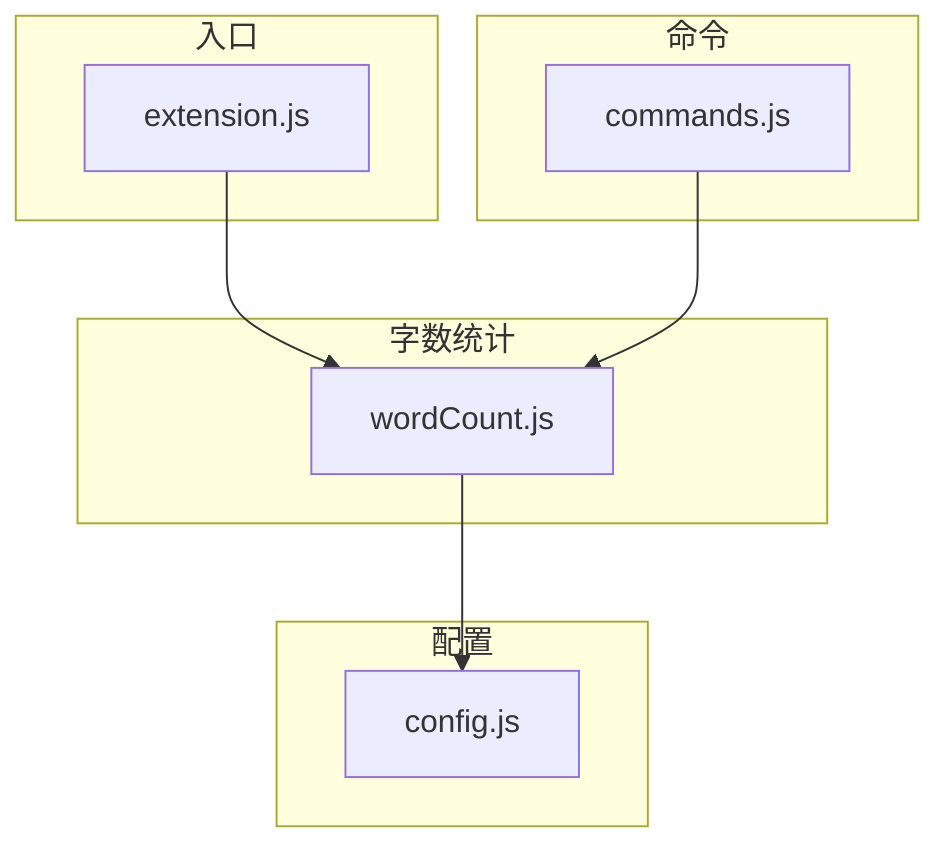

# 字数统计模块

*版本：V1.0，上次更新：2026-6-11*

[模块功能](../README/README.zh-cn.md#2-2.字数统计)

## 1. 模块结构

本模块涉及到的文件如下：

- `wordCount.js`：字数统计模块的主文件；
  - 依赖 `config.js` 获取 `wordCount.enabled`、`wordCount.excludeHeaders`、`wordCount.excludeBlankLines` 等配置项。
  - 导出 `initWordCount(context)`，接收 `ExtensionContext` 用于订阅资源的生命周期管理。
  - 导出 `updateWordCount()`，供外部模块（如 commands.js）手动触发字数刷新。
- `config.js`：获取相关配置；
- `commands.js`：在重载术语索引时调用 `updateWordCount()` 刷新状态栏；
- `extension.js`：扩展入口，在 `activate()` 阶段调用 `initWordCount(context)` 完成初始化。

依赖关系图如下：



---

## 2. 核心数据结构

### 2-1. statusBarItem

一个 `vscode.StatusBarItem` 对象，用于在 VSCode 底部状态栏右侧显示字数。

```javascript
statusBarItem = vscode.window.createStatusBarItem(
    vscode.StatusBarAlignment.Right,  // 状态栏右侧对齐
    100                                // 优先级
);
```

### 2-2. wordCountTimeout

防抖定时器的句柄，类型为 `number | null`。用于避免高频更新（如连续输入时）导致的重复渲染。

### 2-3. computeWordCount 返回值

```javascript
{
    fullChars: number,      // 全文有效字符数
    selectedChars: number,  // 选中区域有效字符数
    isSelected: boolean     // 是否有选区
}
```

这三个字段由 `computeWordCount()` 计算，交由 `updateWordCount()` 消费并渲染。

---

## 3. 核心算法

### 3-1. 字数计算算法

该算法的输入为 `(文档全文, 选区, 配置)`，输出为 `(全文有效字符数, 选区有效字符数)`。

**执行流程：**

```
1. 全文处理
   ├── 按换行符分割全文 → 行数组
   ├── 若 excludeHeaders = true → 滤除以 "#" 开头的行
   └── 若 excludeBlankLines = true → 滤除空行 / 空白行
   └── 合并行数组 → 删除所有空白字符（空格、制表符、换行等）
   └── 取 length → fullChars

2. 选区处理（仅在选区存在时执行）
   ├── 按换行符分割选区文本 → 行数组
   ├── 若 excludeHeaders = true → 滤除以 "#" 开头的行
   └── 若 excludeBlankLines = true → 滤除空行 / 空白行
   └── 合并行数组 → 删除所有空白字符
   └── 取 length → selectedChars
```

**统计规则：**

- 有效字符定义为**非空白字符**（`\s` 不纳入统计）。中文、英文、数字、标点符号均计入。
- `excludeHeaders` 仅按行首 `#` 判断，不区分标题级别。
- `excludeBlankLines` 的判断条件是 `trim().length === 0`，即纯空白行或空行。
- 统计不受文件编码影响（VSCode 以 UTF-16 读取，`length` 对 BMP 字符返回 1，对补充平面字符返回 2，但日常使用可忽略此差异）。

**复杂度：** O(N)，N 为文档字符数。

### 3-2. 事件驱动更新算法

字数统计的更新由三类事件驱动，流程如下：

```
用户操作
  ├── 切换编辑器标签页
  │     └── onDidChangeActiveTextEditor → updateWordCount()
  ├── 编辑文档内容（输入、删除、粘贴等）
  │     └── onDidChangeTextDocument → updateWordCount()
  │         （仅当变更的文档是当前活动编辑器时才触发）
  └── 改变选区（鼠标拖动、键盘选中）
        └── onDidChangeTextEditorSelection → updateWordCount()
            （仅当活动编辑器是 .txt 文件时才触发，减少不必要计算）
          ↓
updateWordCount()
  ├── 检查 statusBarItem 是否存在 → 否则跳过
  ├── 检查活动编辑器是否存在 → 否则跳过
  ├── 检查当前文件是否为 .txt → 否则隐藏状态栏
  ├── 检查 wordCount.enabled 是否为 true → 否则隐藏状态栏
  ├── 防抖：取消上一个 setTimeout（16ms），重新排队
  ├── 调用 computeWordCount(doc, selection, config)
  ├── 格式化显示文本
  │     ├── 有选区 → "$(pencil) 选中字数/全文字数"
  │     └── 无选区 → "$(pencil) 全文字数"
  └── 更新 statusBarItem.text 并调用 .show()
```

### 3-3. 防抖机制

当用户连续输入时，`onDidChangeTextDocument` 会高频触发。为避免每次输入都执行完整的计算与 DOM 更新，采用简单的定时器防抖：

```javascript
if (wordCountTimeout) clearTimeout(wordCountTimeout);
wordCountTimeout = setTimeout(() => {
    // 执行计算和渲染
    wordCountTimeout = null;
}, 16);  // 约 60fps，兼顾流畅度与性能
```

16ms 的防抖间隔意味着：
- 快速连续输入时，仅停止输入后约 16ms 才更新一次
- 选区拖拽时同理
- 实测千字规模的 `.txt` 文件单次计算耗时 < 2ms，防抖主要减少的是 DOM 更新频率

---

## 4. 与其他模块的交互

### 4-1. extension.js

扩展激活时调用 `initWordCount(context)` 完成一次初始化。该方法内部：
1. 创建 `statusBarItem`
2. 注册三个事件监听器
3. 立即执行一次 `updateWordCount()` 以显示当前编辑器字数

### 4-2. commands.js

命令 `writing-assistant.reload` 的重载流程中，在重新构建索引后调用 `updateWordCount()`，确保配置变更后字数统计随之刷新。

### 4-3. config.js

`wordCount` 配置项在 `config.js` 中统一加载，结构如下：

```javascript
wordCount: {
    enabled: boolean,           // 是否启用字数统计
    excludeHeaders: boolean,    // 是否排除标题行（以 # 开头的行）
    excludeBlankLines: boolean  // 是否排除空行
}
```

配置变更后需执行 `reloadConfig()` + `updateWordCount()` 才能生效。扩展会在每次 `updateWordCount()` 调用中重新读取 `getConfig()`，因此配置更新是热生效的。

---

## 5. 限制与注意事项

- **仅对 `.txt` 文件启用**：`wordCount.js` 中通过 `doc.fileName.endsWith('.txt')` 判断。这是为了避免在 Markdown、代码文件等场景中产生不必要的统计干扰。如需支持其他文件类型，可将此判断改为可配置项或移除。
- **非空白字符统计**：字数统计的不是"词数"，而是"非空白字符数"，空格、制表符、换行均不纳入。同一段文本在 `.txt` 和 `.md` 中可能因 Markdown 语法符号不同而产生差异。
- **选区统计不独立过滤**：选区内的字符统计与全文适用相同的标题/空行排除规则。如果排除标题行，选中包含 `# 标题` 的部分也不会计入。
- **无选区时不显示 "0"**：当文档为空时，状态栏显示 `$(pencil) 0`；切换到非 `.txt` 文件时隐藏状态栏。
- **状态栏优先级为 100**：如果其他扩展也注册了右侧状态栏项，优先级数值越小越靠右，100 属于中等优先级。

---

## 6. 可扩展性

若需增加其他统计功能（如字符级 vs 词级统计、统计标点、统计空格等），可在 `computeWordCount()` 中扩展计算逻辑，新增配置项并在 `config.js` 和 `package.json` 的 `contributes.configuration` 中声明即可。
